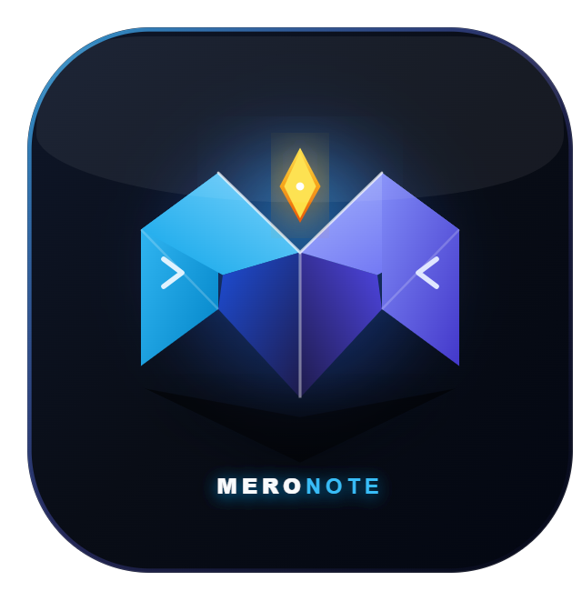
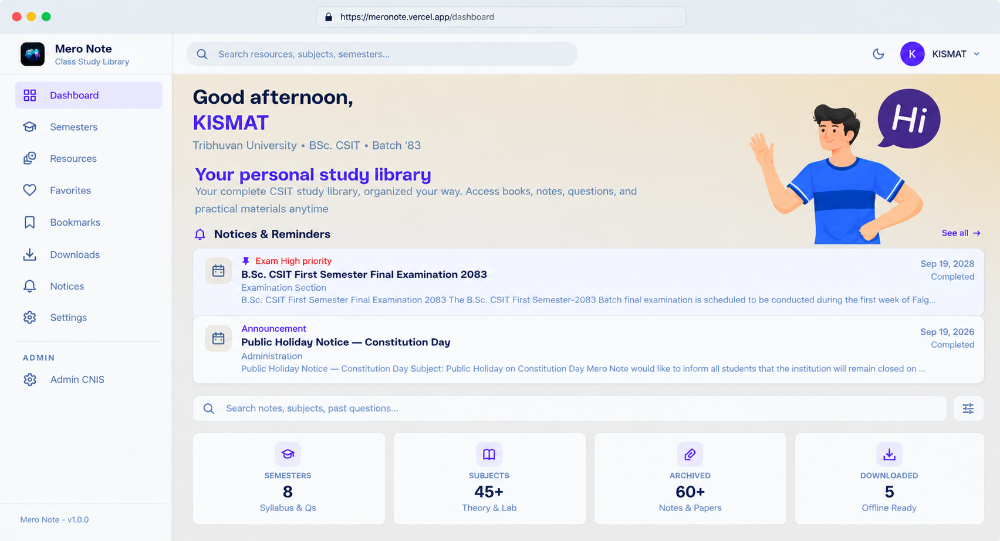
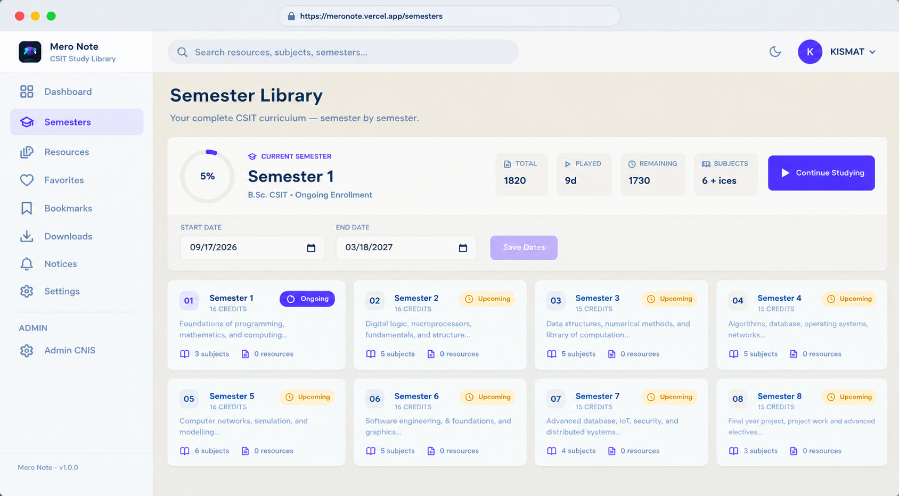
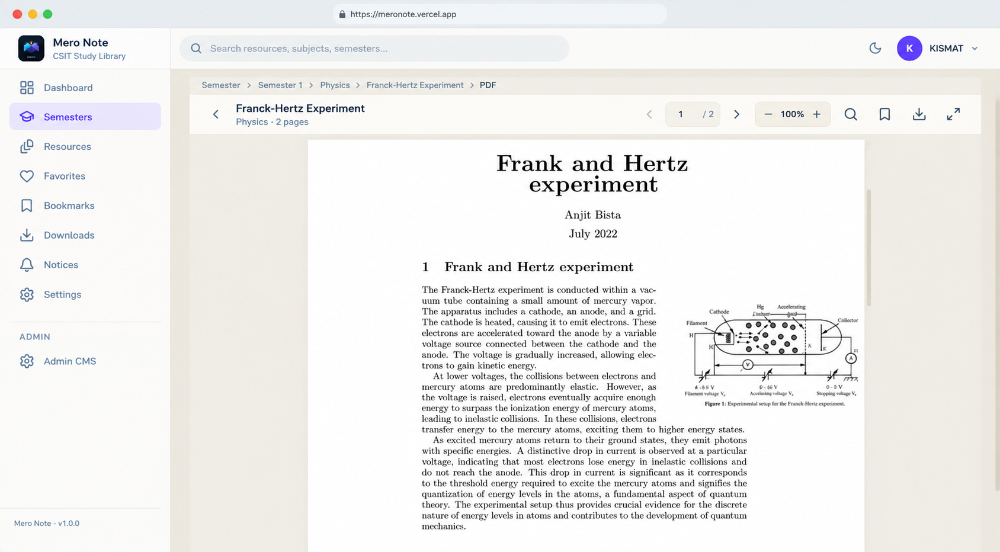

<p align="center">
  
</p>

<h1 align="center">Mero Note</h1>

<p align="center">Personal-first CSIT study library for desktop and mobile.</p>

<p align="center">
  <a href="https://meronote.vercel.app/"></a>
  <a href="docs/README.md"></a>
</p>

<p align="center">
  <a href="#features">Features</a> ·
  <a href="#tech-stack">Tech Stack</a> ·
  <a href="#getting-started">Getting Started</a> ·
  <a href="#product-preview">Preview</a> ·
  <a href="#live-demo">Live Demo</a>
</p>

## Features

- Semester → Subject → Topic → Resource library organization
- Unified search across semesters, subjects, topics, resources, books, and notices
- PDF reader with zoom, page navigation, bookmarks, and reading progress
- Favorites, bookmarks, continue reading, and recent resources
- Offline downloads for studying without internet
- Semester planning with progress tracking
- Notices board for announcements and deadlines
- Admin CMS for managing semesters, subjects, topics, resources, books, and notices
- Light / dark / system theme
- PWA support with mobile-friendly navigation

## Tech Stack

**Frontend**


**Backend**


**Storage**


## Project Structure

```
MeroNote/
├── client/   # React + Vite + TS + Tailwind frontend
├── server/   # Express + TS API
├── docs/     # project documentation
└── README.md
```

## Getting Started

Install dependencies for both apps:

```bash
# backend
cd server
npm install

# frontend
cd ../client
npm install
```

Run the backend:

```bash
cd server
npm run dev
```

API runs at `http://localhost:5000`.

Run the frontend:

```bash
cd client
npm run dev
```

Opens at `http://localhost:5173` backed by the API above.

<details>
<summary><b>Seed & admin (development)</b></summary>

```bash
cd server
npm run seed:dev                    # dev data (refuses production)
npm run promote-admin -- you@email  # grant ADMIN (refuses production)
```

</details>

## Requirements

- Node.js >= 20 < 28
- npm
- MongoDB Atlas (or local MongoDB) for the backend

## Environment Variables

<details>
<summary><b>Show variables</b></summary>

Create `server/.env` (variable names come from `server/src/config/env.ts`):

```bash
MONGODB_URI=mongodb+srv://...
JWT_SECRET=your-secret
CLIENT_URL=http://localhost:5173
# Storage ops only:
B2_KEY_ID=...
B2_APPLICATION_KEY=...
B2_BUCKET_NAME=...
```

The client needs no env file for local development (`VITE_API_URL`
defaults to `http://localhost:5000`).

</details>

## Product Preview

<table align="center">
  <tr>
    <td align="center">
      <a href="https://meronote.vercel.app/">
        
      </a>
    </td>
    <td align="center">
      <a href="https://meronote.vercel.app/">
        
      </a>
    </td>
    <td align="center">
      <a href="https://meronote.vercel.app/">
        
      </a>
    </td>
  </tr>
  <tr>
    <td align="center"><b>Dashboard</b></td>
    <td align="center"><b>Resource</b></td>
    <td align="center"><b>PDF Viewer</b></td>
  </tr>
</table>

## Documentation

**Architecture**
[](docs/architecture/system.md)
[](docs/architecture/backend.md)
[](docs/architecture/database.md)
[](docs/architecture/authentication.md)
[](docs/architecture/storage.md)

**Features**
[](docs/features/pdf-reader.md)
[](docs/features/offline-cache.md)
[](docs/features/downloads.md)
[](docs/features/personalization.md)
[](docs/features/search-discovery.md)
[](docs/features/admin-portal.md)
[](docs/features/landing-page.md)

**Operations & Project**
[](docs/operations/deployment.md)
[](docs/operations/known-issues.md)
[](docs/project/agent.md)
[](docs/project/product.md)

> Full index: [`docs/README.md`](docs/README.md)

## Live Demo

**Deployed on Vercel**

<p align="center">
  <a href="https://meronote.vercel.app/"></a>
</p>

## Creator

**Designed & Developed by**

<p align="center">
  
  <a href="https://www.instagram.com/kisma_tt07/"></a>
</p>

<p align="center"><a href="#mero-note">Back to top</a></p>
