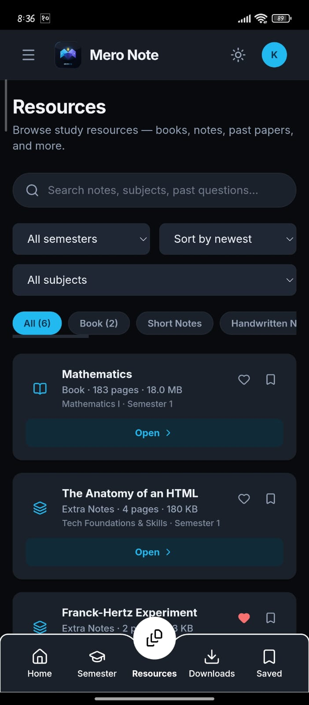
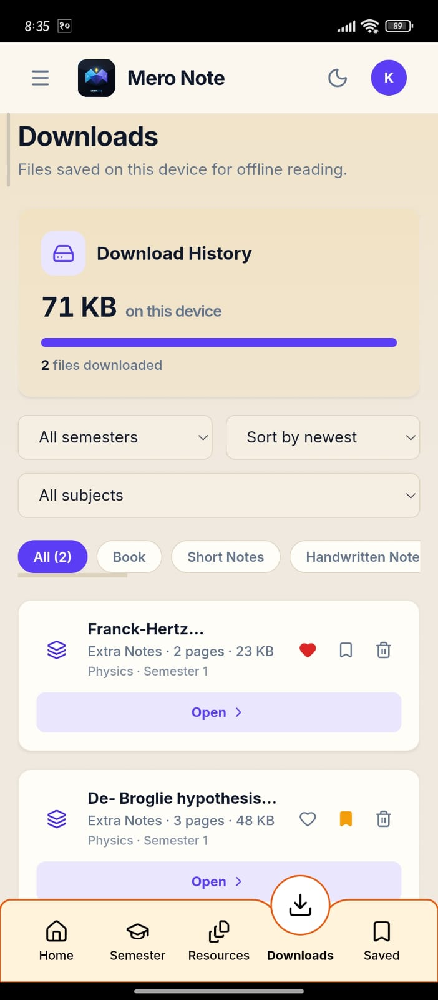
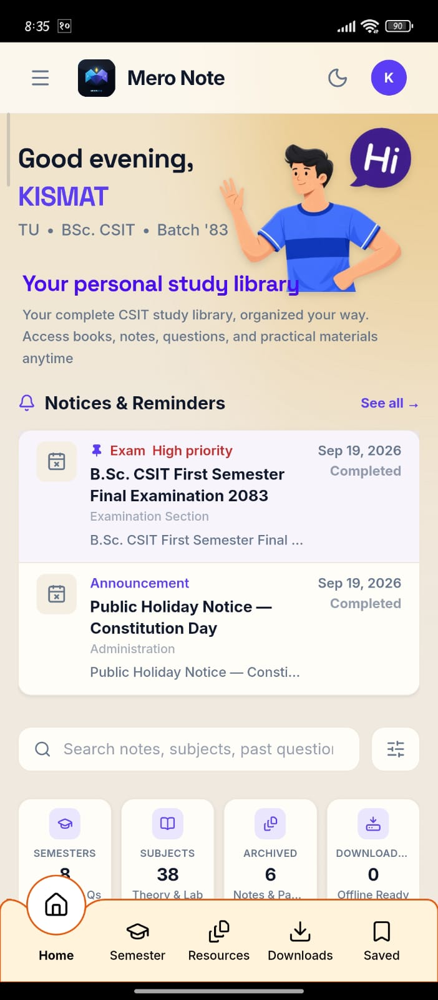

# Mero Note

Personal-first CSIT study library for desktop and mobile.

## Features

- Semester → Subject → Topic → Resource library organization
- Unified search across semesters, subjects, topics, resources, books, and notices
- PDF reader with zoom, page navigation, bookmarks, and reading progress
- Favorites, bookmarks, continue reading, and recent resources
- Offline downloads for studying without internet
- Semester planning with progress tracking
- Notices board for announcements and deadlines
- Admin CMS for managing semesters, subjects, topics, resources, books, and notices
- Light / dark / system theme
- PWA support with mobile-friendly navigation

## Tech Stack

**Frontend:** React 18, Vite 6, TypeScript, Tailwind CSS v4, PDF.js, React Router

**Backend:** Node.js, Express 4, TypeScript, Mongoose, JWT, bcryptjs, B2 SDK

**Storage:** MongoDB Atlas, Backblaze B2 (private bucket)

## Project Structure

```
MeroNote/
├── client/   # React + Vite + TS + Tailwind frontend
├── server/   # Express + TS API
├── docs/     # project documentation
└── README.md
```

## Getting Started

Install dependencies for both apps:

```bash
# backend
cd server
npm install

# frontend
cd ../client
npm install
```

Run the backend:

```bash
cd server
npm run dev
```

API runs at `http://localhost:5000`.

Run the frontend:

```bash
cd client
npm run dev
```

Opens at `http://localhost:5173` backed by the API above.

Optional — seed development data and grant admin access:

```bash
cd server
npm run seed:dev                    # dev data (refuses production)
npm run promote-admin -- you@email  # grant ADMIN (refuses production)
```

## Requirements

- Node.js >= 20 < 28
- npm
- MongoDB Atlas (or local MongoDB) for the backend

## Environment Variables

Create `server/.env` (variable names come from `server/src/config/env.ts`):

```bash
MONGODB_URI=mongodb+srv://...
JWT_SECRET=your-secret
CLIENT_URL=http://localhost:5173
# Storage ops only:
B2_KEY_ID=...
B2_APPLICATION_KEY=...
B2_BUCKET_NAME=...
```

The client needs no env file for local development (`VITE_API_URL`
defaults to `http://localhost:5000`).

## Product Preview

<p align="center">
  
  
  
</p>

## Documentation

Start at [`docs/README.md`](docs/README.md) — system, backend, database,
authentication, storage, features, and operations.

## Live Demo

https://meronote.vercel.app/

## Creator

Designed & Developed by **KISMAT DAHAL**

https://www.instagram.com/kisma_tt07/
